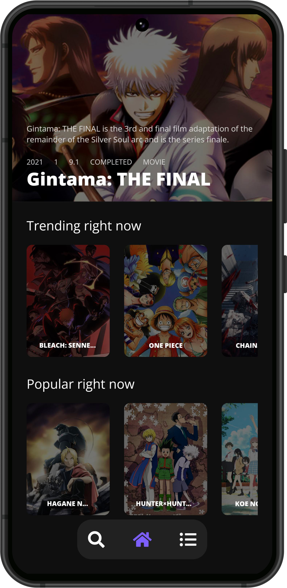
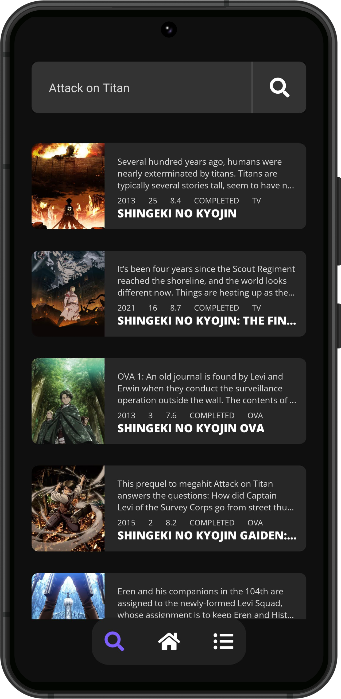
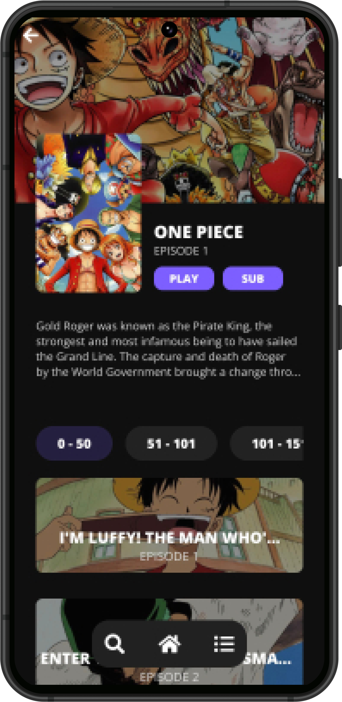
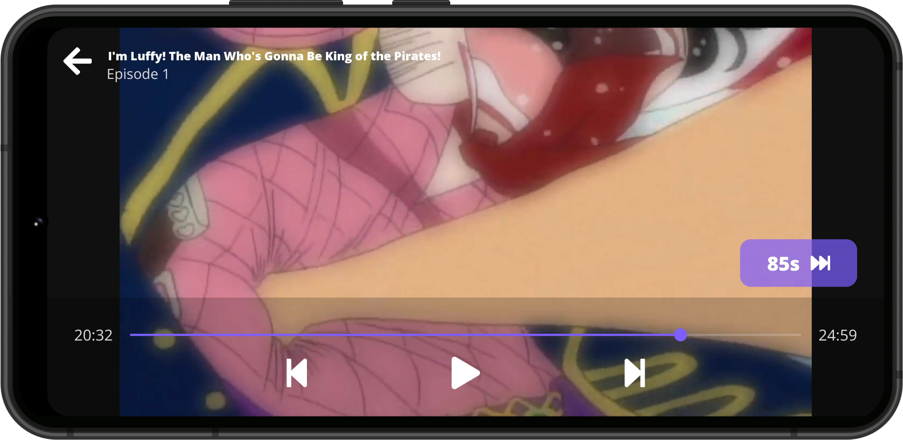

 

---

 

    

    
    
    
  

 

## DISCLAIMER

The app is still in alpha, so it may not work as expected. If you find any bugs, please report them in the [issues](https://github.com/TDanks2000/StreamAble-app/issues) section.

## Features/Planned Features

- [x] Ad Free
- [x] Fast
- [x] Responsive
- [x] Custom video player
- [x] Dub support
- [X] Collections support (Plant to watch, watching, watched, backlog, etc)
- [X] Sync with anilist
- [ ] Manga support **(NEXT RELEASE)**
- [ ] Download Episodes

 

## SCREENSHOTS

<table>
  <thead>
    <tr>
      <th colspan="5">ANDROID</th>
    </tr>
  </thead>
  <tbody>
    <tr>
        <td>
            
        </td>
        <td>
            
        </td>
        <td>
            
        </td>
    </tr>
    <tr>
        <td colspan="3">
            
        </td>
    </tr>
  </tbody>
</table>

## INSTALLATION INSTRUCTIONS

ANDROID

Make sure you have install from unknown sources enabled

it will most likely ask you to enable this anyway

1. [Download the apk.](https://github.com/TDanks2000/StreamAble-app/releases)
2. Install the apk.
3. Open the app.

 

## Shoutouts 

    
    

<strong>Thank you to aidan for being there when I need his help, be sure to check this legend out</strong>
 
<strong>Thank you to the consumet team and discord for making the amazing api and helping with the design</strong>

<strong>And a big big big thank you to all that have downloaded the app so far, and gave feedback. You all warm my heart</strong>

 

## License

 
 
 

## ❤️

StreamAble is made with the love and passion that I have for anime and manga. I hope you enjoy it as much as I do. If you have any suggestions or feedback, please contact me on discord (Prostarz#9361)

 

# ❤️

Reminder that <strong><i>you are great, you are enough, and your presence is valued.</i></strong> If you are struggling with your mental health, please reach out to someone you love and consult a professional. You are not alone.
