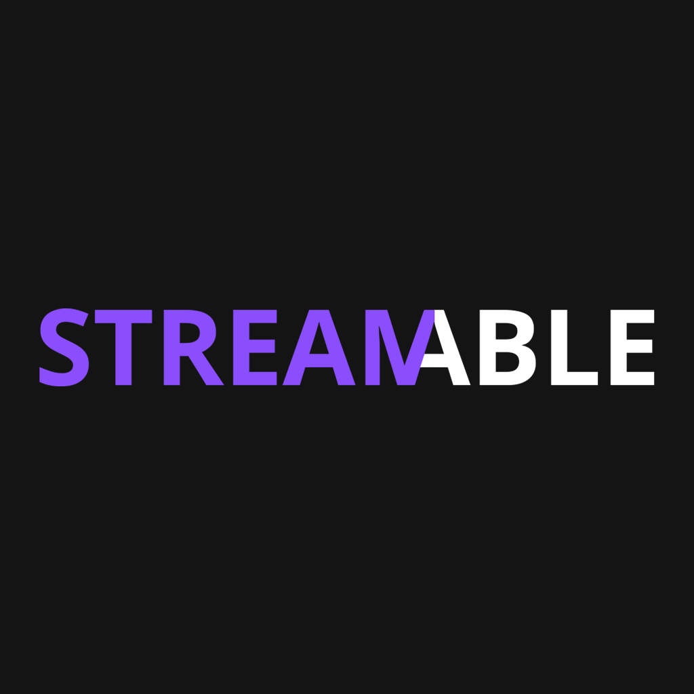

 

---

 

    

    
    
  

 

## DISCLAIMER

The app is still in alpha, so it may not work as expected. If you find any bugs, please report them in the [issues](https://github.com/TDanks2000/StreamAble-app/issues) section.

## Features/Planned Features

- [x] Ad Free
- [x] Custom video player
- [ ] Dub support
- [ ] Sync with anilist, mal etc etc
- [ ] Collections support (Plant to watch, watching, watched, backlog, etc)
- [ ] Picture in picture
- [ ] Download Episodes
- [ ] Manga support

 

## INSTALLATION INSTRUCTIONS

ANDROID

Make sure you have install from unknown sources enabled

it will most likely ask you to enable this anyway

1. [Download the apk.](https://sstreamable.netlify.app/download/app)
2. Install the apk.
3. Open the app.

 

## Contributors

 

## License

 
 
 

## ❤️

StreamAble is made with the love and passion that I have for anime and manga. I hope you enjoy it as much as I do. If you have any suggestions or feedback, please contact me on discord (Prostarz#9361)

 

# ❤️

### Reminder that _you are great, you are enough, and your presence is valued._ If you are struggling with your mental health, please reach out to someone you love and consult a professional. You are not alone.
